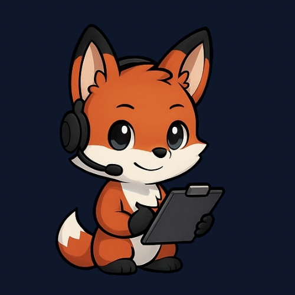

# Echo Brand Assets

**Echo** is our clever, tech-savvy fox mascot who represents the heart and soul of NodeByte Hosting. She's here to make infrastructure feel a little more personal — from guiding users through dashboards, popping up in 404s, or keeping devs company in Discord.

> "Reliable, friendly, and always watching over your servers — meet Echo."

---

## About Echo

Echo is an anthropomorphic fox with a passion for tech, crafted in a modern, cartoon style to match NodeByte's playful yet professional identity. From cheerful stickers to helpful error pages, she brings our brand to life across platforms.

**Key Traits:**

-   Fluffy tail, expressive eyes, and a hoodie with violet accents
-   Confident, curious, and kind — the perfect digital sidekick
-   Designed for clean integration into UIs, stickers, and more

---

## Asset Types

-   **Stickers & Emojis** — Expressive, Discord-ready PNGs
-   **404/500 Art** — Unique art for error pages with personality
-   **Animations (WIP)** — Light, clean motions for UI and social media
-   **Transparent & Themed Variations** — For all use cases

---

## Usage Guidelines

You're welcome to use Echo in projects **within the NodeByte ecosystem**. For licensing, requests, or to contribute ideas:

> Reach out via [hello@nodebyte.host](mailto:hello@nodebyte.host) or open an issue!

---

## Asset Gallery

| Preview                              | Description                        | Usage                          |
| ----------------------------------- | ---------------------------------- | ------------------------------ |
|           | Echo waving hello                  | Welcome screens, greetings     |
|       | Echo sitting down                  | Idle states, loading screens   |
| | Echo monitoring stuff              | Dashboard, monitoring views    |
|         | Echo taking a support call         | Support sections, help pages   |
|       | Echo taking another support call   | Alternative support imagery    |
|            | Echo playing VR                    | Tech/gaming related sections   |
|          | Echo can not be found             | 404 error pages               |
|          | Echo sees an error                | 500 error pages               |

---

## Contributing

Got an idea for a new Echo expression or pose? We'd love to see it!

-   Submit a feature request
-   Share design references
-   Or help us animate!

---

## Licensing

Echo is a **NodeByte Hosting** brand asset. Please do not use her outside NodeByte-related projects without permission.

---

## Made with love by

**CodeMeAPixel** & **NodeByte Hosting**