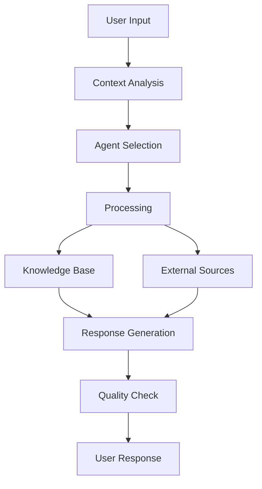

# AI System Documentation

Echo's AI system is built on a sophisticated multi-agent architecture designed to provide intelligent, context-aware interactions across various use cases.

## Agent Architecture

### Core Agents

1. **Conversation Agent**
   - Maintains natural conversation flow
   - Handles context persistence
   - Manages message history
   - Performs sentiment analysis
   - Implements personality consistency

2. **Knowledge Agent**
   - Manages information retrieval
   - Validates knowledge entries
   - Handles data categorization
   - Maintains semantic search
   - Updates training data

3. **Research Agent**
   - Performs web searches via Tavily
   - Analyzes documentation
   - Synthesizes information
   - Implements retry logic
   - Provides fallback responses

4. **Technical Support Agent**
   - Handles support tickets
   - Diagnoses technical issues
   - Provides step-by-step solutions
   - Manages escalations
   - Tracks resolution status

5. **Code Analysis Agent**
   - Reviews code quality
   - Suggests improvements
   - Detects security issues
   - Provides optimization tips
   - Validates implementations

## System Integration

### Data Flow


### Response Format
```typescript
interface AgentResponse {
  content: string;              // Main response content
  needsResearch?: boolean;      // External research flag
  searchQuery?: string;         // Research query
  error?: string;              // Error information
  metadata?: object;           // Additional context
  confidence: number;          // Response confidence score
  source?: string;            // Information source
}
```

## Features

### Natural Language Processing
- Context-aware responses
- Personality maintenance
- Sentiment analysis
- Language adaptation
- Topic tracking

### Knowledge Management
- Dynamic knowledge base
- Automatic categorization
- Content validation
- Source tracking
- Version control

### Quality Control
- Response validation
- Confidence scoring
- Content filtering
- Bias detection
- Safety checks

### Performance Optimization
- Response caching
- Rate limiting
- Load balancing
- Batch processing
- Efficient token usage

## Configuration

### Environment Setup
```env
OPENAI_API_KEY=your_openai_key
TAVILY_API_KEY=your_tavily_key
AI_MODEL=gpt-4-turbo-preview
TEMPERATURE=0.7
MAX_TOKENS=2000
```

### Model Selection
Echo uses different models for different tasks:
- GPT-4 Turbo: Complex reasoning, code analysis
- GPT-3.5 Turbo: Quick responses, simple queries
- Ada: Embeddings and semantic search
- Claude: Alternative for specific use cases

## Best Practices

### Response Generation
1. Always validate response quality
2. Include confidence scores
3. Provide source references
4. Maintain conversation context
5. Handle errors gracefully

### Knowledge Base
1. Regular content updates
2. Quality validation
3. Source verification
4. Version tracking
5. Regular cleanup

### Performance
1. Implement caching strategies
2. Use appropriate models
3. Optimize token usage
4. Monitor response times
5. Track usage metrics

## Security Considerations

### Data Protection
- Personal information handling
- Data retention policies
- Access control
- Encryption standards
- Audit logging

### Content Safety
- Input validation
- Output filtering
- Bias detection
- Content moderation
- User verification

## Monitoring

### Metrics
- Response times
- Success rates
- Error frequency
- Token usage
- User satisfaction

### Alerts
- Error rate thresholds
- Response time issues
- Token limit warnings
- System health status
- API availability
