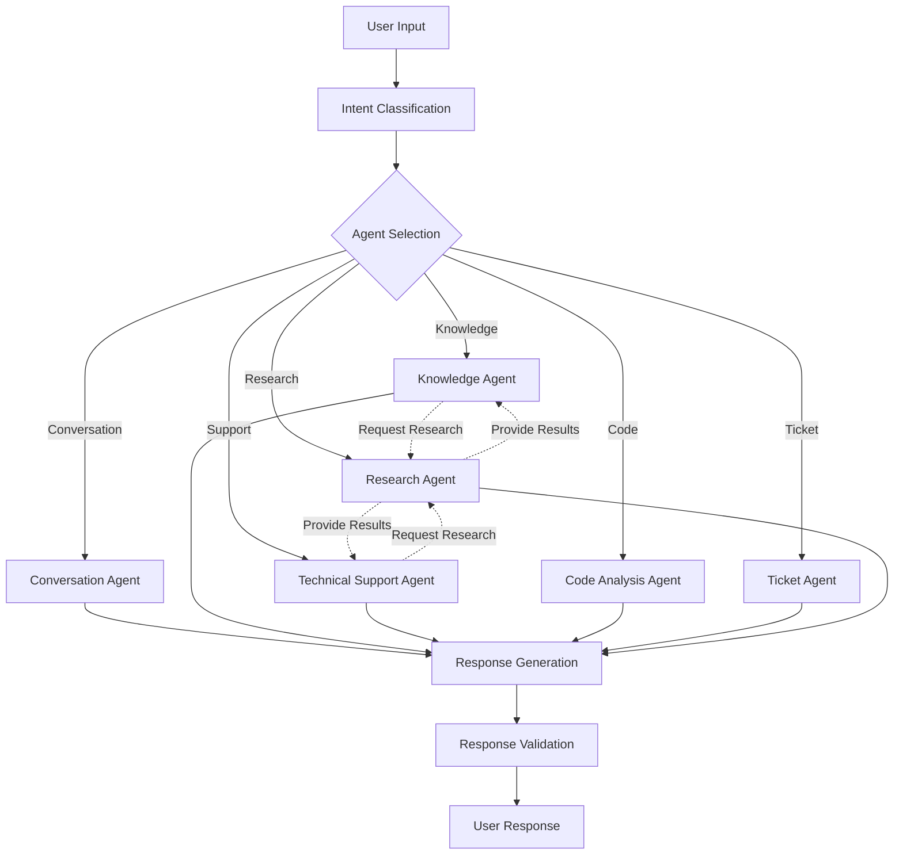

# AI System Documentation

Echo's AI system is built on a sophisticated multi-agent architecture designed to provide intelligent, context-aware interactions across various use cases.

## Agent Architecture

### Core Agents

1. **Conversation Agent**

    - Maintains natural conversation flow
    - Handles context persistence
    - Manages message history
    - Performs sentiment analysis
    - Implements personality consistency

2. **Knowledge Agent**

    - Manages information retrieval
    - Validates knowledge entries
    - Handles data categorization
    - Maintains semantic search
    - Updates training data
    - Handles "Save this as:" requests
    - Implements rate limiting for content creation

3. **Research Agent**

    - Performs web searches via Tavily
    - Analyzes documentation
    - Synthesizes information
    - Implements retry logic
    - Provides fallback responses
    - Supports background research
    - Integrates with other agents
    - Caches research results

4. **Technical Support Agent**

    - Handles support tickets
    - Diagnoses technical issues
    - Provides step-by-step solutions
    - Manages escalations
    - Tracks resolution status

5. **Ticket Agent**

    - Creates and manages support tickets
    - Assigns tickets to support agents
    - Tracks ticket status and priority
    - Handles ticket-related communications
    - Collects user feedback

6. **Code Analysis Agent**
    - Reviews code quality
    - Suggests improvements
    - Detects security issues
    - Provides optimization tips
    - Validates implementations
    - Handles various analysis types:
        - Static analysis
        - Performance analysis
        - Memory analysis
        - Complexity analysis
        - Security analysis
        - Dependency analysis
        - Coverage analysis

## Prompt System

Echo uses a dynamic, file-based prompt system that significantly enhances its flexibility and maintainability:

### Key Features

- **Template-Based**: Prompts are stored as template files with the `.echo` extension
- **Context-Aware**: Templates can include variables, conditionals, and loops
- **Centralized Management**: All prompts are managed by the `promptService`
- **Extensible**: New templates can be added without code changes
- **Versioned**: Templates are stored in version control for tracking changes
- **Hot-Reloadable**: Templates can be reloaded without restarting the service

### Prompt Selection Logic

The system automatically selects the most appropriate prompt based on:

1. Message context (DM vs. server)
2. Detected entities (users, channels, roles)
3. Message type (conversation, technical, knowledge, etc.)
4. Agent type (which specialized agent is handling the request)

For complete details, see [Prompt System Documentation](./prompts.md).

## System Integration

### Agent Collaboration Patterns

The agents in Echo work together through several collaboration patterns:

1. **Sequential Processing**

    - Message is classified and routed to the most appropriate agent
    - If the primary agent needs help, it can delegate to other agents

2. **Research Augmentation**

    - Knowledge and Support agents can request research assistance
    - Research agent enhances responses with external information
    - Results are integrated into the final response

3. **Background Research**

    - For certain conversation types, research happens in the background
    - Results are cached for future related questions
    - Improves response quality without increasing latency

4. **Context Sharing**
    - Agents share context about the conversation
    - Previous interactions inform current responses
    - User preferences and history are maintained across agents

### Data Flow



### Response Format

```typescript
interface AgentResponse {
    content: string // Main response content
    needsResearch?: boolean // External research flag
    searchQuery?: string // Research query
    error?: string // Error information
    metadata?: object // Additional context
    confidence: number // Response confidence score
    source?: string // Information source
    sourceResults?: Array<{
        title: string
        link: string
        snippet: string
    }> // Research sources
}
```

## Features

### Natural Language Processing

-   Context-aware responses
-   Personality maintenance
-   Sentiment analysis
-   Language adaptation
-   Topic tracking

### Knowledge Management

-   Dynamic knowledge base
-   Automatic categorization
-   Content validation
-   Source tracking
-   Version control

### Quality Control

-   Response validation
-   Confidence scoring
-   Content filtering
-   Bias detection
-   Safety checks

### Performance Optimization

-   Response caching
-   Rate limiting
-   Load balancing
-   Batch processing
-   Efficient token usage

## Configuration

### Environment Setup

```env
OPENAI_API_KEY=your_openai_key
TAVILY_API_KEY=your_tavily_key
AI_MODEL=gpt-4-turbo-preview
TEMPERATURE=0.7
MAX_TOKENS=2000
```

### Model Selection

Echo uses different models for different tasks:

-   GPT-4 Turbo: Complex reasoning, code analysis
-   GPT-3.5 Turbo: Quick responses, simple queries
-   Ada: Embeddings and semantic search
-   Claude: Alternative for specific use cases

## Best Practices

### Response Generation

1. Always validate response quality
2. Include confidence scores
3. Provide source references
4. Maintain conversation context
5. Handle errors gracefully

### Knowledge Base

1. Regular content updates
2. Quality validation
3. Source verification
4. Version tracking
5. Regular cleanup

### Performance

1. Implement caching strategies
2. Use appropriate models
3. Optimize token usage
4. Monitor response times
5. Track usage metrics

## Security Considerations

### Data Protection

-   Personal information handling
-   Data retention policies
-   Access control
-   Encryption standards
-   Audit logging

### Content Safety

-   Input validation
-   Output filtering
-   Bias detection
-   Content moderation
-   User verification

## Monitoring

### Metrics

-   Response times
-   Success rates
-   Error frequency
-   Token usage
-   User satisfaction

### Alerts

-   Error rate thresholds
-   Response time issues
-   Token limit warnings
-   System health status
-   API availability

### Performance Optimization

### Response Caching

Echo implements an intelligent caching system to improve response times:

```javascript
// Generate a cache key for responses
_generateCacheKey = (prompt, context) => {
    // Normalize prompt by trimming, lowercasing, and removing extra spaces
    const normalizedPrompt = prompt.trim().toLowerCase().replace(/\s+/g, ' ')

    // Don't cache complex or personalized queries
    if (
        prompt.length > 150 ||
        context.personalData ||
        normalizedPrompt.includes('my ') ||
        normalizedPrompt.includes('I ')
    ) {
        return null
    }

    // Create a stable key from the normalized prompt
    return `response:${normalizedPrompt}`
}
```

### Serialization

To prevent circular reference errors, all complex objects are serialized before being passed to the AI model:

```javascript
// Before passing to AI model
const safeObject = makeSerializable(complexObject)
```

### Background Processing

Non-blocking operations are used for improved responsiveness:

```javascript
// Start background research without blocking the response
_performBackgroundResearch = async (prompt, userId) => {
    try {
        // Start research in the background
        const researchResults = await this.researchAgent.process(prompt, userId)

        // Store the results for potential future use
        this._cacheResearchResults(userId, prompt, researchResults)
    } catch (error) {
        console.error('Background research failed:', error)
    }
}
```
